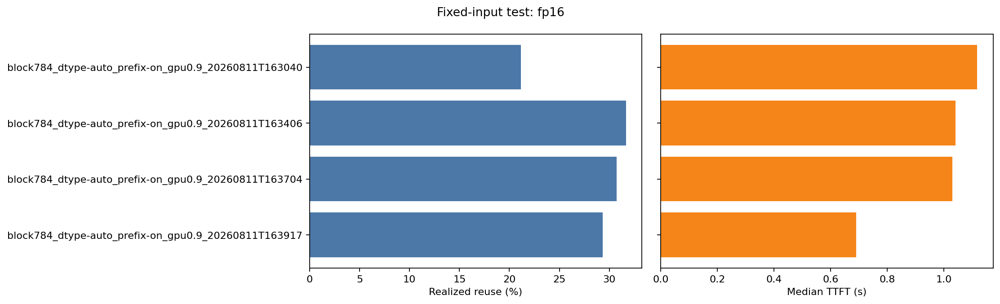

# Fixed-input Test — fp16

_Generated 2026-08-11 · 4 arm(s) · prefill-only replay._

## Summary — tokens

| arm | calls | total input | total output | cache queries | cache hits | realized reuse | repetitions |
| --- | ---: | ---: | ---: | ---: | ---: | ---: | ---: |
| block 784 · auto · prefix on · GPU 0.90 · 08-11 16:30 | 11 | 96,386 | 352 | 96,386 | 20,384 | 21.15% | 1 |
| block 784 · auto · prefix on · GPU 0.90 · 08-11 16:34 | 17 | 165,818 | 544 | 165,818 | 52,528 | 31.68% | 1 |
| block 784 · auto · prefix on · GPU 0.90 · 08-11 16:37 | 14 | 122,460 | 448 | 122,460 | 37,632 | 30.73% | 1 |
| block 784 · auto · prefix on · GPU 0.90 · 08-11 16:39 | 12 | 74,798 | 384 | 74,798 | 21,952 | 29.35% | 1 |

## Summary — time and configuration

| arm | median TTFT | median TPOT | median request latency | wall | vs baseline |
| --- | ---: | ---: | ---: | ---: | ---: |
| block 784 · auto · prefix on · GPU 0.90 · 08-11 16:30 | 1.12s | 14.60ms/token | 1.56s | 16.21s | baseline |
| block 784 · auto · prefix on · GPU 0.90 · 08-11 16:34 | 1.04s | 14.64ms/token | 1.50s | 23.39s | -6.89% TTFT |
| block 784 · auto · prefix on · GPU 0.90 · 08-11 16:37 | 1.03s | 14.65ms/token | 1.49s | 18.60s | -7.81% TTFT |
| block 784 · auto · prefix on · GPU 0.90 · 08-11 16:39 | 0.69s | 14.64ms/token | 1.14s | 14.03s | -38.19% TTFT |

11 calls, 96,386 total input tokens, output fixed at 32 tokens per request, replayed in `packed` mode from `GenoMAS_A_c2_w1_20260809_211004_A_c2_w1.json`.

**Not comparable** — different bundles: GenoMAS_A_c2_w1_20260805_152115_A_c2_w1.json, GenoMAS_A_c2_w1_20260809_193357_A_c2_w1.json, GenoMAS_A_c2_w1_20260809_211004_A_c2_w1.json, GenoMAS_A_c2_w1_20260811_111925_A_c2_w1.json; different call counts: 11, 12, 14, 17; different total input: 122460, 165818, 74798, 96386.

Every arm reports the same serving config; the server was not restarted with a different knob between them, so any difference above is run-to-run noise, not a knob effect.

## Per arm

### block 784 · auto · prefix on · GPU 0.90 · 08-11 16:30

- Bundle: `GenoMAS_A_c2_w1_20260809_211004_A_c2_w1.json` · mode: `packed` · cache: `cold_by_reset` · repetitions: 1

**Server config**

| key | value |
| --- | --- |
| `_block_size_resolved` | `True` |
| `block_size` | `784` |
| `cache_dtype` | `auto` |
| `calculate_kv_scales` | `False` |
| `enable_prefix_caching` | `True` |
| `engine` | `0` |
| `gpu_memory_utilization` | `0.9` |
| `is_attention_free` | `False` |
| `kv_cache_dtype_skip_layers` | `[]` |
| `kv_cache_max_concurrency` | `10.114942528735632` |
| `kv_cache_memory_bytes` | `None` |
| `kv_cache_size_tokens` | `1325785` |
| `kv_offloading_backend` | `native` |
| `kv_offloading_size` | `None` |
| `kv_sharing_fast_prefill` | `False` |
| `mamba_block_size` | `16` |
| `mamba_cache_dtype` | `auto` |
| `mamba_cache_mode` | `align` |
| `mamba_page_size_padded` | `None` |
| `mamba_ssm_cache_dtype` | `float32` |
| `num_cpu_blocks` | `None` |
| `num_gpu_blocks` | `1760` |
| `num_gpu_blocks_override` | `None` |
| `prefix_caching_hash_algo` | `sha256` |
| `prefix_match_unit` | `16` |
| `skip_page_size_padded` | `None` |
| `sliding_window` | `None` |
| `user_specified_block_size` | `True` |
| `user_specified_mamba_block_size` | `False` |

**Artifacts**

- repetition 1: [summary](block784_dtype-auto_prefix-on_gpu0.9_20260811T163040/rep0/summary.json) · [requests](block784_dtype-auto_prefix-on_gpu0.9_20260811T163040/rep0/requests.jsonl) · [metrics before](block784_dtype-auto_prefix-on_gpu0.9_20260811T163040/rep0/metrics_before.prom) · [metrics after](block784_dtype-auto_prefix-on_gpu0.9_20260811T163040/rep0/metrics_after.prom)

---

### block 784 · auto · prefix on · GPU 0.90 · 08-11 16:34

- Bundle: `GenoMAS_A_c2_w1_20260809_193357_A_c2_w1.json` · mode: `packed` · cache: `cold_by_reset` · repetitions: 1

**Server config**

| key | value |
| --- | --- |
| `_block_size_resolved` | `True` |
| `block_size` | `784` |
| `cache_dtype` | `auto` |
| `calculate_kv_scales` | `False` |
| `enable_prefix_caching` | `True` |
| `engine` | `0` |
| `gpu_memory_utilization` | `0.9` |
| `is_attention_free` | `False` |
| `kv_cache_dtype_skip_layers` | `[]` |
| `kv_cache_max_concurrency` | `10.114942528735632` |
| `kv_cache_memory_bytes` | `None` |
| `kv_cache_size_tokens` | `1325785` |
| `kv_offloading_backend` | `native` |
| `kv_offloading_size` | `None` |
| `kv_sharing_fast_prefill` | `False` |
| `mamba_block_size` | `16` |
| `mamba_cache_dtype` | `auto` |
| `mamba_cache_mode` | `align` |
| `mamba_page_size_padded` | `None` |
| `mamba_ssm_cache_dtype` | `float32` |
| `num_cpu_blocks` | `None` |
| `num_gpu_blocks` | `1760` |
| `num_gpu_blocks_override` | `None` |
| `prefix_caching_hash_algo` | `sha256` |
| `prefix_match_unit` | `16` |
| `skip_page_size_padded` | `None` |
| `sliding_window` | `None` |
| `user_specified_block_size` | `True` |
| `user_specified_mamba_block_size` | `False` |

**Artifacts**

- repetition 1: [summary](block784_dtype-auto_prefix-on_gpu0.9_20260811T163406/rep0/summary.json) · [requests](block784_dtype-auto_prefix-on_gpu0.9_20260811T163406/rep0/requests.jsonl) · [metrics before](block784_dtype-auto_prefix-on_gpu0.9_20260811T163406/rep0/metrics_before.prom) · [metrics after](block784_dtype-auto_prefix-on_gpu0.9_20260811T163406/rep0/metrics_after.prom)

---

### block 784 · auto · prefix on · GPU 0.90 · 08-11 16:37

- Bundle: `GenoMAS_A_c2_w1_20260811_111925_A_c2_w1.json` · mode: `packed` · cache: `cold_by_reset` · repetitions: 1

**Server config**

| key | value |
| --- | --- |
| `_block_size_resolved` | `True` |
| `block_size` | `784` |
| `cache_dtype` | `auto` |
| `calculate_kv_scales` | `False` |
| `enable_prefix_caching` | `True` |
| `engine` | `0` |
| `gpu_memory_utilization` | `0.9` |
| `is_attention_free` | `False` |
| `kv_cache_dtype_skip_layers` | `[]` |
| `kv_cache_max_concurrency` | `10.114942528735632` |
| `kv_cache_memory_bytes` | `None` |
| `kv_cache_size_tokens` | `1325785` |
| `kv_offloading_backend` | `native` |
| `kv_offloading_size` | `None` |
| `kv_sharing_fast_prefill` | `False` |
| `mamba_block_size` | `16` |
| `mamba_cache_dtype` | `auto` |
| `mamba_cache_mode` | `align` |
| `mamba_page_size_padded` | `None` |
| `mamba_ssm_cache_dtype` | `float32` |
| `num_cpu_blocks` | `None` |
| `num_gpu_blocks` | `1760` |
| `num_gpu_blocks_override` | `None` |
| `prefix_caching_hash_algo` | `sha256` |
| `prefix_match_unit` | `16` |
| `skip_page_size_padded` | `None` |
| `sliding_window` | `None` |
| `user_specified_block_size` | `True` |
| `user_specified_mamba_block_size` | `False` |

**Artifacts**

- repetition 1: [summary](block784_dtype-auto_prefix-on_gpu0.9_20260811T163704/rep0/summary.json) · [requests](block784_dtype-auto_prefix-on_gpu0.9_20260811T163704/rep0/requests.jsonl) · [metrics before](block784_dtype-auto_prefix-on_gpu0.9_20260811T163704/rep0/metrics_before.prom) · [metrics after](block784_dtype-auto_prefix-on_gpu0.9_20260811T163704/rep0/metrics_after.prom)

---

### block 784 · auto · prefix on · GPU 0.90 · 08-11 16:39

- Bundle: `GenoMAS_A_c2_w1_20260805_152115_A_c2_w1.json` · mode: `packed` · cache: `cold_by_reset` · repetitions: 1

**Server config**

| key | value |
| --- | --- |
| `_block_size_resolved` | `True` |
| `block_size` | `784` |
| `cache_dtype` | `auto` |
| `calculate_kv_scales` | `False` |
| `enable_prefix_caching` | `True` |
| `engine` | `0` |
| `gpu_memory_utilization` | `0.9` |
| `is_attention_free` | `False` |
| `kv_cache_dtype_skip_layers` | `[]` |
| `kv_cache_max_concurrency` | `10.114942528735632` |
| `kv_cache_memory_bytes` | `None` |
| `kv_cache_size_tokens` | `1325785` |
| `kv_offloading_backend` | `native` |
| `kv_offloading_size` | `None` |
| `kv_sharing_fast_prefill` | `False` |
| `mamba_block_size` | `16` |
| `mamba_cache_dtype` | `auto` |
| `mamba_cache_mode` | `align` |
| `mamba_page_size_padded` | `None` |
| `mamba_ssm_cache_dtype` | `float32` |
| `num_cpu_blocks` | `None` |
| `num_gpu_blocks` | `1760` |
| `num_gpu_blocks_override` | `None` |
| `prefix_caching_hash_algo` | `sha256` |
| `prefix_match_unit` | `16` |
| `skip_page_size_padded` | `None` |
| `sliding_window` | `None` |
| `user_specified_block_size` | `True` |
| `user_specified_mamba_block_size` | `False` |

**Artifacts**

- repetition 1: [summary](block784_dtype-auto_prefix-on_gpu0.9_20260811T163917/rep0/summary.json) · [requests](block784_dtype-auto_prefix-on_gpu0.9_20260811T163917/rep0/requests.jsonl) · [metrics before](block784_dtype-auto_prefix-on_gpu0.9_20260811T163917/rep0/metrics_before.prom) · [metrics after](block784_dtype-auto_prefix-on_gpu0.9_20260811T163917/rep0/metrics_after.prom)

---

[Back to experiments index](../../results/index.html)

