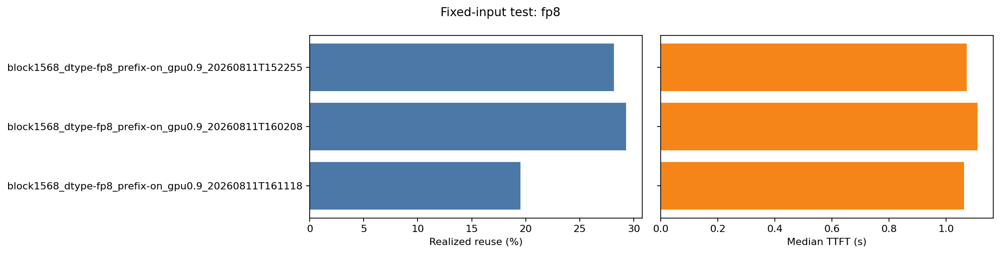

# Fixed-input Test — fp8

_Generated 2026-08-11 · 3 arm(s) · prefill-only replay._

## Summary — tokens

| arm | calls | total input | total output | cache queries | cache hits | realized reuse | repetitions |
| --- | ---: | ---: | ---: | ---: | ---: | ---: | ---: |
| block 1568 · fp8 · prefix on · GPU 0.90 · 08-11 15:22 | 14 | 122,460 | 448 | 122,460 | 34,496 | 28.17% | 1 |
| block 1568 · fp8 · prefix on · GPU 0.90 · 08-11 16:02 | 17 | 165,818 | 544 | 165,818 | 48,608 | 29.31% | 1 |
| block 1568 · fp8 · prefix on · GPU 0.90 · 08-11 16:11 | 11 | 96,386 | 352 | 96,386 | 18,816 | 19.52% | 1 |

## Summary — time and configuration

| arm | median TTFT | median TPOT | median request latency | wall | vs baseline |
| --- | ---: | ---: | ---: | ---: | ---: |
| block 1568 · fp8 · prefix on · GPU 0.90 · 08-11 15:22 | 1.07s | 14.61ms/token | 1.48s | 19.07s | baseline |
| block 1568 · fp8 · prefix on · GPU 0.90 · 08-11 16:02 | 1.11s | 14.64ms/token | 1.56s | 23.92s | +3.52% TTFT |
| block 1568 · fp8 · prefix on · GPU 0.90 · 08-11 16:11 | 1.06s | 14.62ms/token | 1.52s | 15.33s | -0.85% TTFT |

14 calls, 122,460 total input tokens, output fixed at 32 tokens per request, replayed in `packed` mode from `GenoMAS_A_c2_w1_20260811_111925_A_c2_w1.json`.

**Not comparable** — different bundles: GenoMAS_A_c2_w1_20260809_193357_A_c2_w1.json, GenoMAS_A_c2_w1_20260809_211004_A_c2_w1.json, GenoMAS_A_c2_w1_20260811_111925_A_c2_w1.json; different call counts: 11, 14, 17; different total input: 122460, 165818, 96386.

Every arm reports the same serving config; the server was not restarted with a different knob between them, so any difference above is run-to-run noise, not a knob effect.

## Per arm

### block 1568 · fp8 · prefix on · GPU 0.90 · 08-11 15:22

- Bundle: `GenoMAS_A_c2_w1_20260811_111925_A_c2_w1.json` · mode: `packed` · cache: `cold_by_reset` · repetitions: 1

**Server config**

| key | value |
| --- | --- |
| `_block_size_resolved` | `True` |
| `block_size` | `1568` |
| `cache_dtype` | `fp8` |
| `calculate_kv_scales` | `False` |
| `enable_prefix_caching` | `True` |
| `engine` | `0` |
| `gpu_memory_utilization` | `0.9` |
| `is_attention_free` | `False` |
| `kv_cache_dtype_skip_layers` | `[]` |
| `kv_cache_max_concurrency` | `19.166666666666668` |
| `kv_cache_memory_bytes` | `None` |
| `kv_cache_size_tokens` | `2512213` |
| `kv_offloading_backend` | `native` |
| `kv_offloading_size` | `None` |
| `kv_sharing_fast_prefill` | `False` |
| `mamba_block_size` | `16` |
| `mamba_cache_dtype` | `auto` |
| `mamba_cache_mode` | `align` |
| `mamba_page_size_padded` | `None` |
| `mamba_ssm_cache_dtype` | `float32` |
| `num_cpu_blocks` | `None` |
| `num_gpu_blocks` | `1725` |
| `num_gpu_blocks_override` | `None` |
| `prefix_caching_hash_algo` | `sha256` |
| `prefix_match_unit` | `16` |
| `skip_page_size_padded` | `None` |
| `sliding_window` | `None` |
| `user_specified_block_size` | `True` |
| `user_specified_mamba_block_size` | `False` |

**Artifacts**

- repetition 1: [summary](block1568_dtype-fp8_prefix-on_gpu0.9_20260811T152255/rep0/summary.json) · [requests](block1568_dtype-fp8_prefix-on_gpu0.9_20260811T152255/rep0/requests.jsonl) · [metrics before](block1568_dtype-fp8_prefix-on_gpu0.9_20260811T152255/rep0/metrics_before.prom) · [metrics after](block1568_dtype-fp8_prefix-on_gpu0.9_20260811T152255/rep0/metrics_after.prom)

---

### block 1568 · fp8 · prefix on · GPU 0.90 · 08-11 16:02

- Bundle: `GenoMAS_A_c2_w1_20260809_193357_A_c2_w1.json` · mode: `packed` · cache: `cold_by_reset` · repetitions: 1

**Server config**

| key | value |
| --- | --- |
| `_block_size_resolved` | `True` |
| `block_size` | `1568` |
| `cache_dtype` | `fp8` |
| `calculate_kv_scales` | `False` |
| `enable_prefix_caching` | `True` |
| `engine` | `0` |
| `gpu_memory_utilization` | `0.9` |
| `is_attention_free` | `False` |
| `kv_cache_dtype_skip_layers` | `[]` |
| `kv_cache_max_concurrency` | `19.166666666666668` |
| `kv_cache_memory_bytes` | `None` |
| `kv_cache_size_tokens` | `2512213` |
| `kv_offloading_backend` | `native` |
| `kv_offloading_size` | `None` |
| `kv_sharing_fast_prefill` | `False` |
| `mamba_block_size` | `16` |
| `mamba_cache_dtype` | `auto` |
| `mamba_cache_mode` | `align` |
| `mamba_page_size_padded` | `None` |
| `mamba_ssm_cache_dtype` | `float32` |
| `num_cpu_blocks` | `None` |
| `num_gpu_blocks` | `1725` |
| `num_gpu_blocks_override` | `None` |
| `prefix_caching_hash_algo` | `sha256` |
| `prefix_match_unit` | `16` |
| `skip_page_size_padded` | `None` |
| `sliding_window` | `None` |
| `user_specified_block_size` | `True` |
| `user_specified_mamba_block_size` | `False` |

**Artifacts**

- repetition 1: [summary](block1568_dtype-fp8_prefix-on_gpu0.9_20260811T160208/rep0/summary.json) · [requests](block1568_dtype-fp8_prefix-on_gpu0.9_20260811T160208/rep0/requests.jsonl) · [metrics before](block1568_dtype-fp8_prefix-on_gpu0.9_20260811T160208/rep0/metrics_before.prom) · [metrics after](block1568_dtype-fp8_prefix-on_gpu0.9_20260811T160208/rep0/metrics_after.prom)

---

### block 1568 · fp8 · prefix on · GPU 0.90 · 08-11 16:11

- Bundle: `GenoMAS_A_c2_w1_20260809_211004_A_c2_w1.json` · mode: `packed` · cache: `cold_by_reset` · repetitions: 1

**Server config**

| key | value |
| --- | --- |
| `_block_size_resolved` | `True` |
| `block_size` | `1568` |
| `cache_dtype` | `fp8` |
| `calculate_kv_scales` | `False` |
| `enable_prefix_caching` | `True` |
| `engine` | `0` |
| `gpu_memory_utilization` | `0.9` |
| `is_attention_free` | `False` |
| `kv_cache_dtype_skip_layers` | `[]` |
| `kv_cache_max_concurrency` | `19.166666666666668` |
| `kv_cache_memory_bytes` | `None` |
| `kv_cache_size_tokens` | `2512213` |
| `kv_offloading_backend` | `native` |
| `kv_offloading_size` | `None` |
| `kv_sharing_fast_prefill` | `False` |
| `mamba_block_size` | `16` |
| `mamba_cache_dtype` | `auto` |
| `mamba_cache_mode` | `align` |
| `mamba_page_size_padded` | `None` |
| `mamba_ssm_cache_dtype` | `float32` |
| `num_cpu_blocks` | `None` |
| `num_gpu_blocks` | `1725` |
| `num_gpu_blocks_override` | `None` |
| `prefix_caching_hash_algo` | `sha256` |
| `prefix_match_unit` | `16` |
| `skip_page_size_padded` | `None` |
| `sliding_window` | `None` |
| `user_specified_block_size` | `True` |
| `user_specified_mamba_block_size` | `False` |

**Artifacts**

- repetition 1: [summary](block1568_dtype-fp8_prefix-on_gpu0.9_20260811T161118/rep0/summary.json) · [requests](block1568_dtype-fp8_prefix-on_gpu0.9_20260811T161118/rep0/requests.jsonl) · [metrics before](block1568_dtype-fp8_prefix-on_gpu0.9_20260811T161118/rep0/metrics_before.prom) · [metrics after](block1568_dtype-fp8_prefix-on_gpu0.9_20260811T161118/rep0/metrics_after.prom)

---

[Back to experiments index](../../results/index.html)

